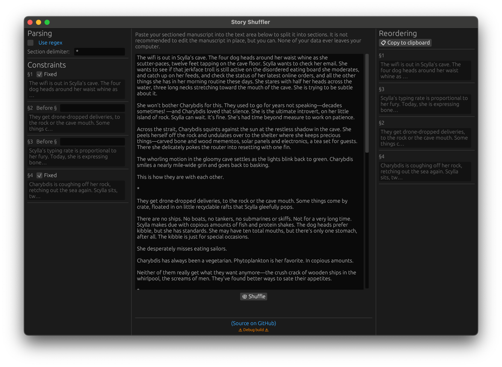

# Story Shuffler

A writer's companion: a manuscript shuffler that obeys ordering constraints.
[Try the webapp.](https://toddatavail.github.io/story-shuffler) You can hover
just about any component for popup help. And don't worry — none of your data
ever leaves your computer.

--------------------------------------------------------------------------------

A while back my wife Cislyn asked me how hard it would be to build an
application that could shuffle the sections of a manuscript. Sometimes writers
would like to try out a different ordering of their sections, but with some
constraints in place, like "leave the beginning and end alone" or "section 4
definitely needs to come before sections 6 and 8."

As with everything, the trick is making the time. Once I finally got around to
it — a year after she asked (sorry, sweetie 😅) — I knocked it out over a
weekend. It was a perfect opportunity to learn something new — in this case,
writing multiplatform GUIs using [`egui`](https://github.com/emilk/egui). I
started with the excellent
[`eframe` template](https://github.com/emilk/eframe_template), and this project
is what I came up with.

This is a screenshot from the native version. The manuscript is Cislyn's
["Tides that Bind"](https://www.diabolicalplots.com/dp-fiction-83a-tides-that-bind-by-cislyn-smith/), published by
[Diabolical Plots](https://www.diabolicalplots.com/).

If you are tech-savvy enough to build Rust programs from source, then knock
yourself out. I might upload some native binaries at some point in the near
future.

But you probably just want to use the web interface, which is
[here](https://toddatavail.github.io/story-shuffler).

Pretty much everything has hover help, so hopefully correct usage is
discoverable. But here's the process in a nutshell:

* Paste your manuscript into the central text area. It won't preserve rich-text
  formatting, sorry. This would take quite a lot of custom code, too, so I'm
  not sure if it's in the cards.
* Set the delimiter to your section break delimiter. The default is dinkus
  (`* * *`).
* Set any constraints. You can lock the first and last sections in place by
  marking the `Fixed` checkbox.
* Click the `Shuffle` button under your manuscript.
* Click the `Copy to clipboard` button to copy your reordered and
  reassembled manuscript to the system clipboard.
* Paste your new manuscript into an external document.

I had a lot of fun building this app, and I hope _Story Shuffler_ helps somebody
out.
